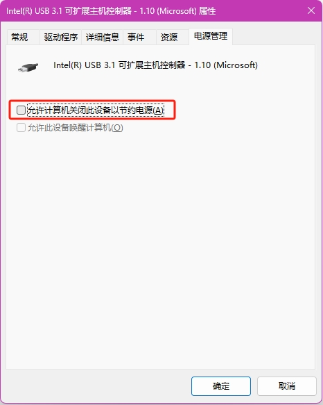
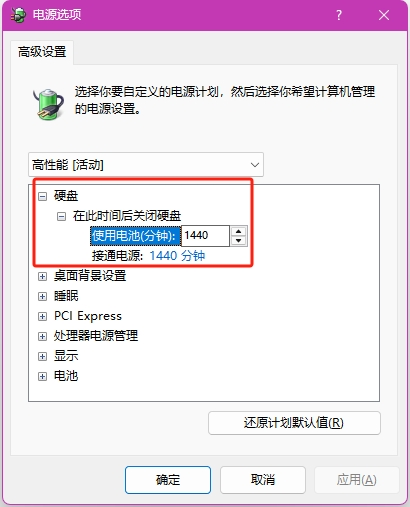
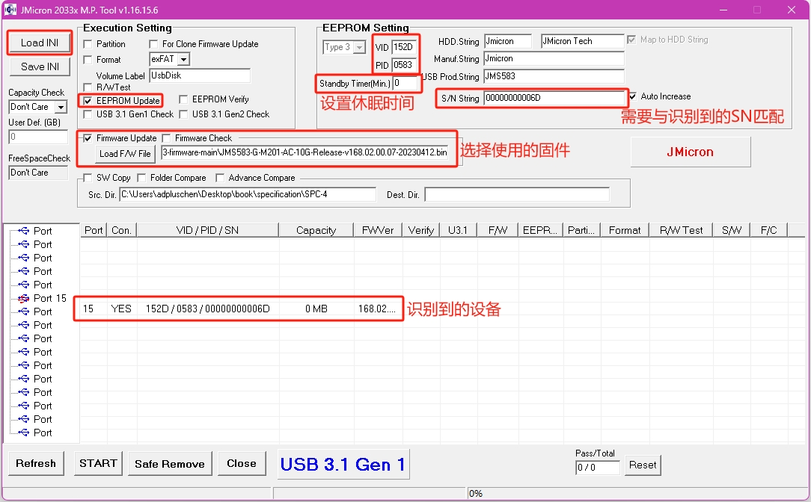
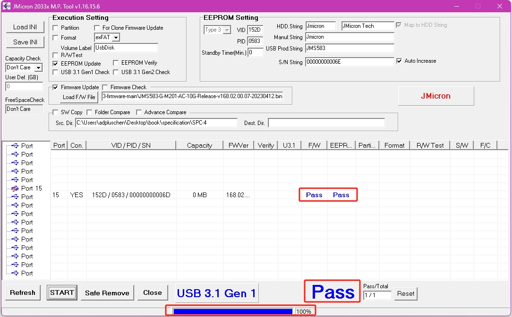

# ITGZ-JMS583
## 1 使用问题
### 1.1 笔记本USB-A口不识别JMS583硬盘盒
笔记本型号：ThinkPad P14s Gen1
CPU：Intel CORE i7 vPRO 10TH GEN
系统：WINDOWS11
问题描述：插上ITGZ-JMS583硬盘盒指示灯显示青色
分析：根据厂家描述工作指示灯状态：绿灯亮工作正常、绿灯闪烁读写数据，蓝灯亮休眠，安全弹出绿灯蓝灯同时亮；那么插入USB-A口后为弹出状态，经测试插入TYPE-C口可以正常工作
结果：查阅资料，确定为USB-A口供电问题
解决方法：关闭USB-A口的省电模式，按下述流程操作（USB可扩展主机控制器名称根据实际情况选择，如果不确定是哪一个可以全部设置，依次排除，我这里只有两个，没有找软件与硬件接口的对应方法）
桌面计算机图标右键 -> 显示更多选项 -> 管理 -> 设备管理器 -> 通用串行总线控制器 -> Intel(R) USB 3.1 可扩展主机控制器 - 1.10 (Microsoft) -> 右键 -> 属性 -> 电源管理 -> 取消 `允许计算机关闭此设备以节约电源` 项的对勾 -> 确定
重新插拔硬盘盒，可以正常识别

  

### 1.2 设置休眠时间后不生效
问题描述：通过下面介绍的方法设置休眠时间，但是硬盘盒仍然过一段时间就会休眠，现象是硬盘盒指示灯亮蓝色
解决方法：经查阅资料，发现是Window系统电源设置问题，可以按下述流程操作
控制面板 -> 硬件和声音 -> 电源选项 -> 更改计划设置(根据当前选定的计划是平衡还是高性能选择对应的设置) -> 更改高级电源设置(C) -> 硬盘 -> 在此时间后关闭硬盘 -> 设置使用电池和接通电源的时间，单位分钟
这里设置的是1440分钟，对应一天24小时，根据个人使用情况设置

  

## 2 固件
固件下载链接：https://www.station-drivers.com/index.php/zh/driverss/Drivers/Jmicron/JMS583-NVMe-USB-3.1-Controller/orderby,4/lang,zh-cn/
(写本文档时间：20250617，最新固件版本：Jmicron JMS583 Sata USB 3.1 Controller Firmware Version 168.2.00.07)
固件位置：JMS583_fw_168.0.2.0.7
## 3 烧录
仅烧录固件可以使用上面链接下载的压缩包里的FwUpdateTool工具就可以，如果需要设置不休眠，需要使用JMMassprod2工具
JMMassprod2工具位置：JMMassprod2
1）打开JMMassprod2_v1_16_15_6.exe
2）点击左上角 Load INI 按钮，选择 JMMassProd.ini 文件
3）插入 JMS583 硬盘盒（建议拔掉固态硬盘，设置不当会导致格式化硬盘），检查是否识别到设备，如果没有识别到需要先解决识别问题，可以尝试方法 `1.1笔记本USB-A口不识别JMS583硬盘盒`
在 Execution Setting 中只选择 EEPROM Update
在 EEPROM Setting 中注意修改 VID、PID、"S/N String"，这三个默认是从 ini 文件中读取出来的值，不是设备实际值，需要按实际情况修改。**PID下方的Standby Timer(Min)是休眠时间设置，单位秒，设置为0表示不休眠**
固件可以选择购买商家提供的，也可以用上面下载的固件，这里用下载的最新版固件，点击`Load F/W File`按钮，选择下载的固件
如下图：

  

4）点击左下角 START 开始烧录，烧录完成会提示 PASS，如下图

  

